# 🔒 Splunk Enterprise SIEM Security Monitoring Lab

A fully functional Security Information and Event Management (SIEM) home lab engineered to centralize logs, monitor network infrastructure, and catch live cyber attacks. Out of Wazuh, Azure Sentinel, and Splunk, I found Splunk to be amazing because of its GUI, deep customization options, and how easy it is to navigate. Adding my pfSense firewall data to Splunk was also way simpler compared to Wazuh, making it the perfect choice for this project. 

The lab is built on a virtualized architecture where network traffic and endpoint logs are streamed into a central Splunk instance, allowing for real-time blue-team threat detection and analysis.

---

## 🧰 Technologies & Tools

| Category | Technology |
|---|---|
| SIEM Platform | Splunk Enterprise 10.4.0 |
| Hosting Environment | Ubuntu Server via Linux KVM Hypervisor (Hosted on TrueNAS Scale) |
| Firewall / Router | Netgate pfSense Plus |
| Log Forwarding | Syslog-ng (pfSense) + Splunk Universal Forwarders (Endpoints) |
| IDS/IPS | Suricata (Integrated with pfSense) |
| Attacker Platforms | Kali Linux |
| Target Environments | Windows Client + Windows Server Active Directory Domain Controller |
| Attack Tools Used | Nmap, CrackMapExec, Custom Brute-Force Scripts |

---

## 🏗️ Lab Infrastructure & Log Ingestion Setup

The infrastructure focuses on collecting data from different layers of the network to give complete visibility over the environment.

### Splunk Installation on KVM
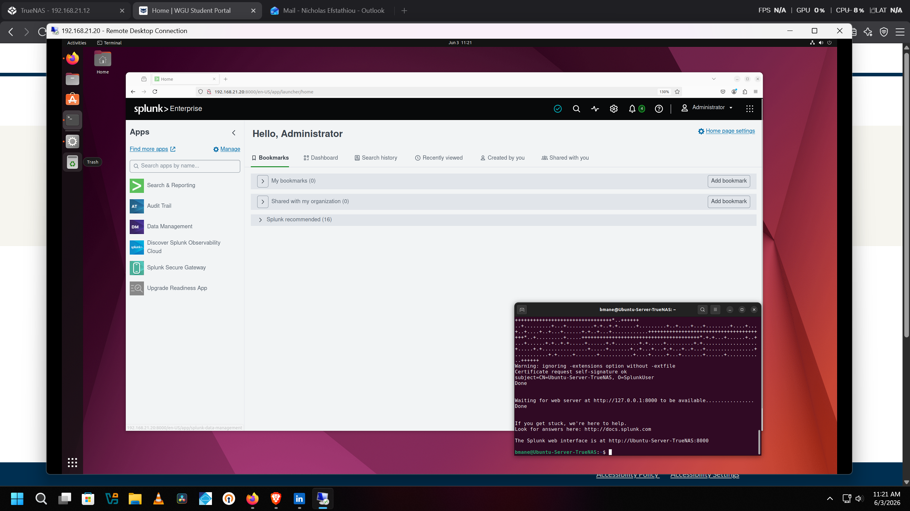
Splunk Enterprise up and running inside an Ubuntu Server virtual machine, hosted via the Linux KVM hypervisor on my TrueNAS hardware.

### Accessing the SIEM Interface
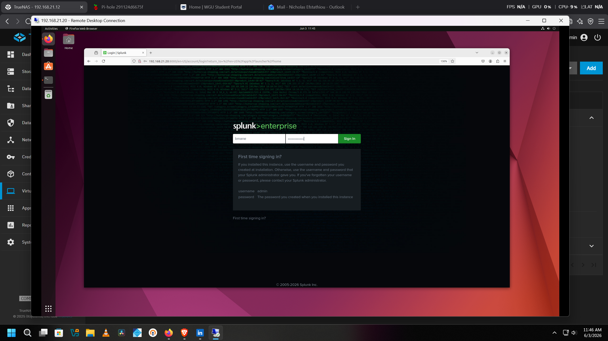
Logging into the Splunk web interface from the management network to verify access to the newly deployed server instance.

### Network Ingestion via pfSense
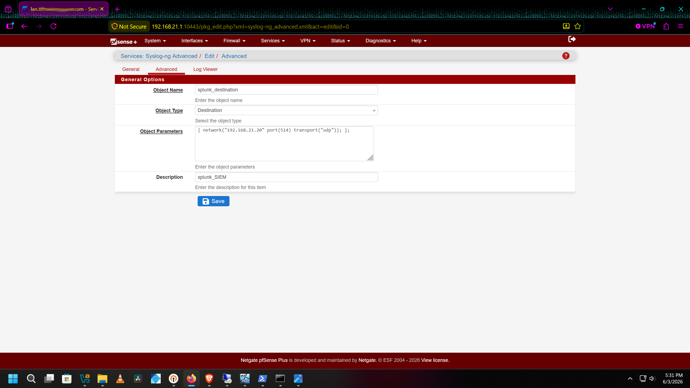
Configuring advanced syslog-ng settings on the pfSense firewall. This rule sends all network traffic and system logs directly to the Splunk SIEM destination over UDP port 514.

### Endpoint Forwarder Deployment
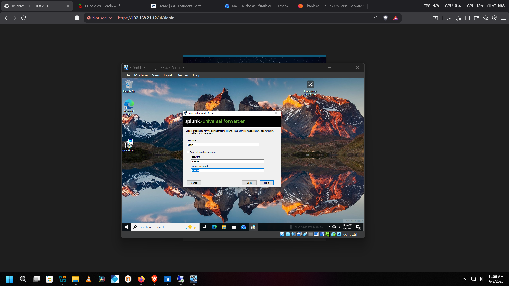
Deploying the Splunk Universal Forwarder installer on a Windows client machine to securely collect and send local Windows Event Logs to the main indexer.

### Verification of Connected Devices
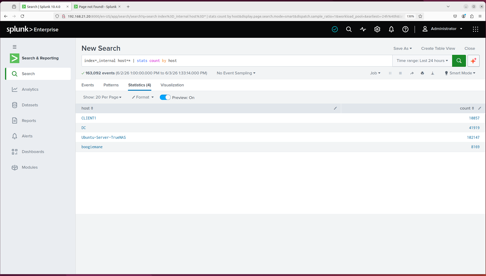
Running an internal search (`index=_internal host=* | stats count by host`) to verify that all four core hosts are successfully forwarding logs to Splunk: the Windows Client, the Active Directory Domain Controller (DC), the Ubuntu Splunk Server, and the target test host.

---

## 🔍 Attack Simulations & Detection Engineering

Once logging was fully set up, I used Kali Linux to run various offensive simulations against the network to see if my custom Splunk alerts would catch them.

### Active Security Alerts Overview
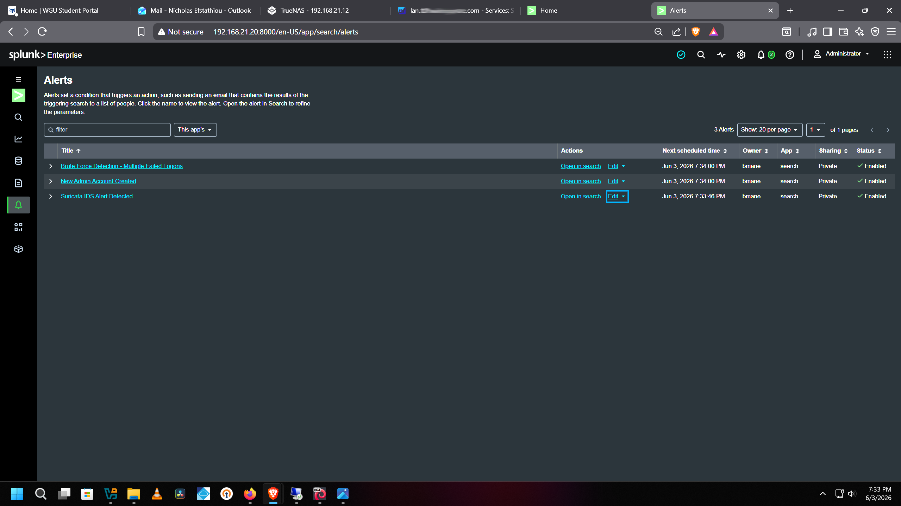
The main Alerts dashboard showing my three active, custom-engineered rules enabled and monitoring the environment: Brute Force Detection, New Admin Account Created, and Suricata IDS Alert Detected.

### 1. Nmap Scan Detection
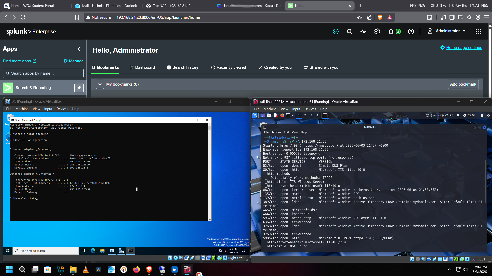
Running an aggressive Nmap scan (`nmap -sS -sV -A`) from a Kali Linux VM against the Active Directory Domain Controller. Splunk monitors the rapid connection attempts to detect the reconnaissance phase before an actual attack happens.

### 2. Brute-Force Attack Logs
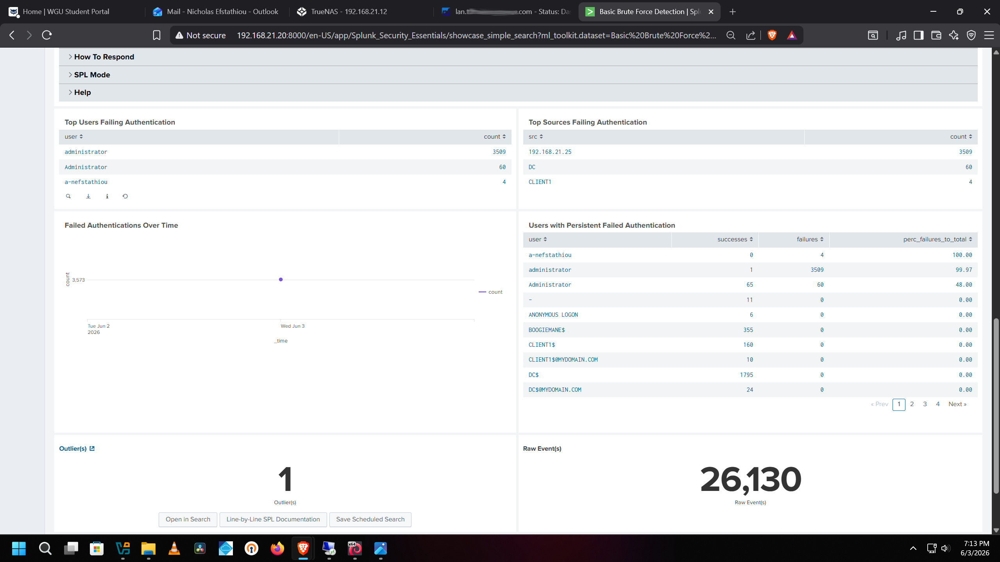
Splunk Security Essentials dashboard catching a massive brute-force attack consisting of 3,509 failed authentication attempts originating from the Kali Linux host machine. The analytics automatically map out the top targeted accounts and source IPs.

### 3. CrackMapExec Password Spraying
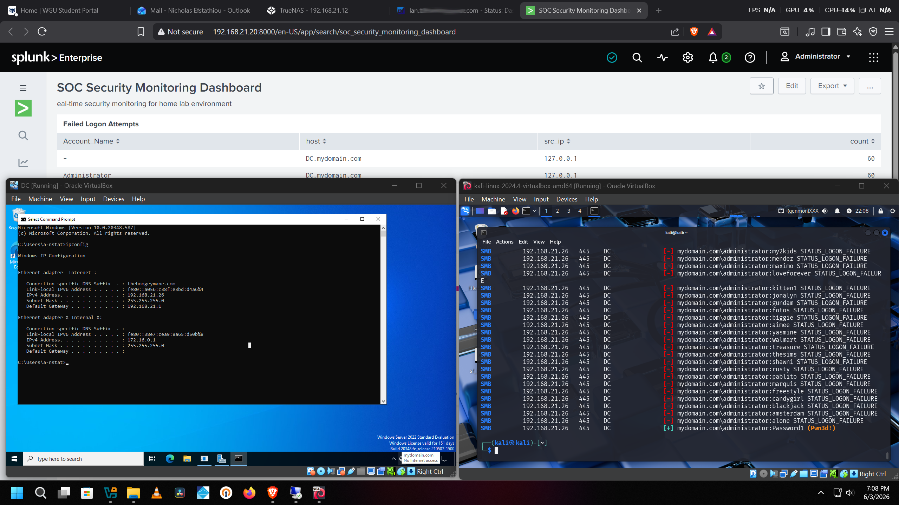
Tracking a live password spray simulation against the Domain Controller using CrackMapExec. The logs catch the exact moments the tool attempts to authenticate across multiple network accounts to find a weakness.

### 4. Rogue Local Admin Creation
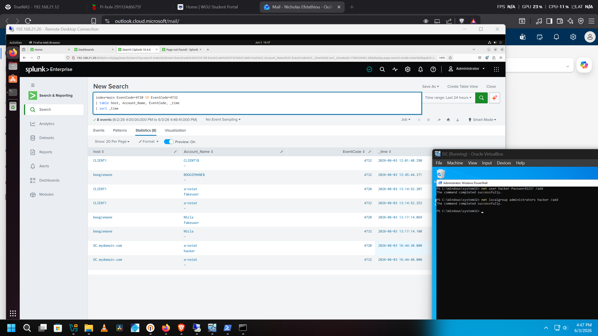
A high-severity detection rule tracking unauthorized privilege escalation. When a backdoor administrator account named "hacker" is created and added to the local administrators group via PowerShell, Splunk instantly catches it by correlation filtering for Windows Event Codes 4720 and 4732.

### 5. Raw Suricata IDS Search
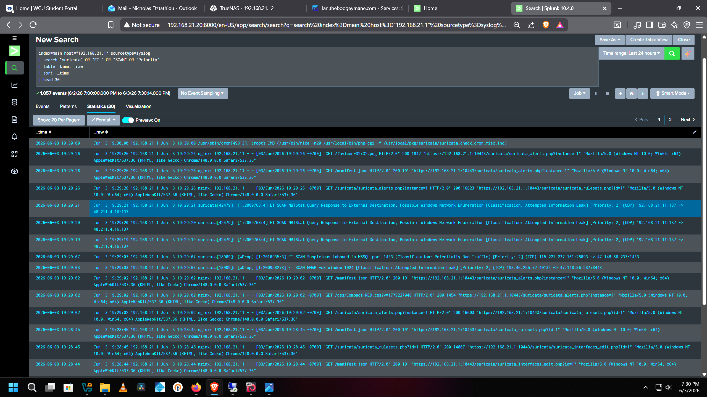
Diving into the raw Suricata network signature logs inside Splunk to investigate automated network probes, malicious traffic patterns, and dropped packets.

---

## 📊 Security Operations Dashboards & Auditing

To keep things organized, I built dashboards to monitor overall network health and specific security alerts in one place.

### SOC Security Monitoring Dashboard v2
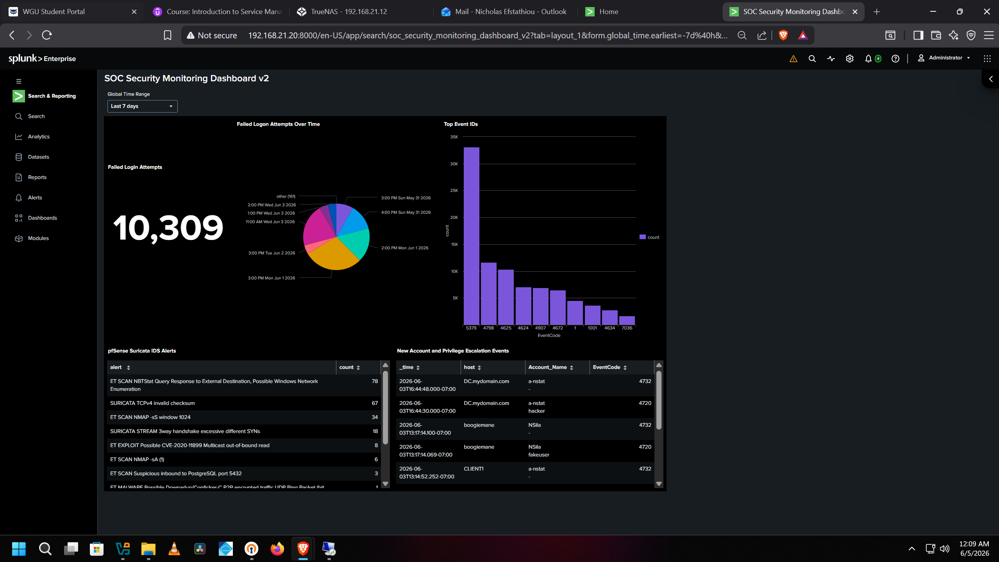
A fully consolidated Security Operations Center dashboard built to surface the most important security data across the entire environment in a single view. The dashboard covers four core areas: a Failed Logon Attempts Over Time chart tracking authentication failures over the last 7 days (10,309 total during testing), a pie chart breaking down failed login volume by time window to identify attack patterns, a Top Event IDs bar chart visualizing the most frequently triggered Windows Event Codes across all endpoints, a pfSense Suricata IDS Alerts panel displaying live network intrusion signatures ranked by hit count, and a New Account and Privilege Escalation Events table correlating Event Codes 4720 and 4732 to catch unauthorized account creation and group membership changes in real time.

---

## 🙋 Author

**Nick Efstathiou** Cybersecurity | Network Engineering | Home Lab  
[LinkedIn](https://www.linkedin.com/in/NickStat23)
